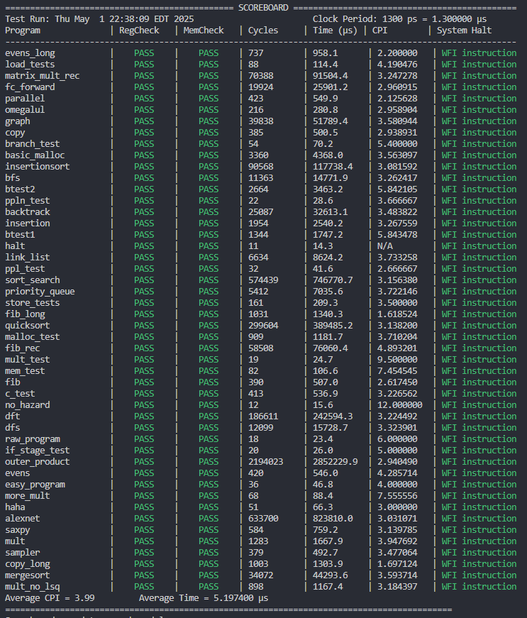
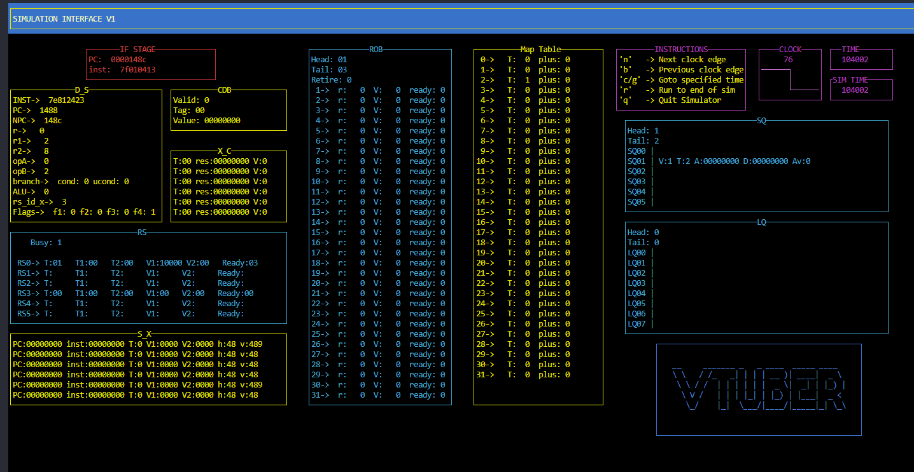

# Project Summary

This is our Out of Order full pipeline based on the Pentium VI architecture. It implements nonblocking dcache and icache, prefetching in
the icache, a forwarding split queue in-order LSQ, and an advanced branch predictor. 

## Verification

In addition, we have implemented a visual debugger that
can be used to step through clock cycles and see the output of each data structure. For example, for **program.c:** run `make program.vis`

Debugging can also be done by creating/uncommenting relevant print tasks in **pipeline_test.sv**  and running `make program.out`

And the print tasks will output to the .out files, with clock cycle timestamps. 

To investigate the waveforms for a testbench run `make program.verdi`

### Verification Scripts 

To recompile and check for correctness, place a correct .out and .wb file in the **correct_out** folder, and run `./run_sim_tests.sh [program1.s] [program2.c] [program3.s] ...`, where no arguments run all files in the **programs** folder, the `-s` option runs all **assembly (.s)** files and the `-c`option runs all **.c** files.

As synthesis takes a long time, `./run_syn_tests.sh` uses **make -j $(nproc) simulate_syn_all** under the hood to run all jobs in parallel, then does the comparison for the indicated files (.syn.out and .syn.wb), same as for ./run_sim_tests.sh. So check output with the previous script first.

The result of the scripts is written to the terminal and **scoreboard.log**, the current syn output for the finished processor is shown below:




### Vtuber Debugger
To run the Vtuber, read the INSTALL_NCURSES file for a tutorial. It displays the processor’s internal state cycle-by-cycle, including the ROB, Reservation Station, and functional units.

An example run of the vtuber:



# EECS 470 Final Project

Welcome to the EECS 470 Final Project!

This is the repository for your implementation of an out-of-order,
synthesizable, RISC-V processor with advanced features.

See the [Project Specification](https://drive.google.com/file/d/1z8MC70pnj0iMrgUmu1rYOlS5uGNltmwG/view?usp=drive_link)
for more details on deadlines and the overall structure of the project.

### Autograder Submission

For milestone 1, just submit the code and add commands below to both
run your testbench and view coverage for the testbench. We will be
grading it manually.

```
TODO: Add commands to run your single module testbench here

# To run and check the output:

# both synthesizable/simulated versions give same output. We included two modules because
# we started working on the whole processor but want to be graded primarily on rs_stage

make map_table.syn.out
make rs_stage.syn.out

# To view coverage:
make rs_stage.coverage
```

For other autograder submissions, we require these three things:

- Running `make simv` will compile a simulation executable for your
  processor

- Running `make syn_simv` will compile a synthesis executable for your
  processor

- Running `./simv +MEMORY=program.mem` (or `./syn_simv`) will run the
  processory with the given program and output the `@@@` memory values
  as in project 3.

One note on memory ouput: when you start implementing your data cache,
you will need to ensure that any dirty cache values get written in the
memory output instead of the value from memory. This will require
exposing your cache at the top level and editing the `show_mem` task in
`test/pipeline_test.sv`.

## General Files

### The Makefile

To make it work for a module `mod`, create the files `verilog/mod.sv`
and sv testbench `test/mod_test.sv` which implement and test the module. If you
update the `TESTED_MODULES` variable in the Makefile, then it will
be able to link the new targets below.

The most straightforward targets are `make mod.pass`,
`make mod.syn.pass` and `make mod.coverage`, which check if the module
passes the testbench in simulation, if it passes the testbench in
synthesis, and print the output of coverage for the module.

``` make
# ---- Module Testbenches ---- #
# NOTE: these require files like: 'verilog/rob.sv' and 'test/rob_test.sv'
#       which implement and test the module: 'rob'
make <module>.pass   <- greps for "@@@ Passed" or "@@@ Incorrect" in the output
make <module>.out    <- run the testbench (via <module>.simv)
make <module>.simv   <- compile the testbench executable
make <module>.verdi  <- run in verdi (via <module>.simv)
make <module>.syn.pass   <- greps for "@@@ Passed" or "@@@ Incorrect" in the output
make <module>.syn.out    <- run the synthesized module on the testbench
make <module>.syn.simv   <- compile the synthesized module with the testbench
make synth/<module>.vg   <- synthesize the module
make <module>.syn.verdi  <- run in verdi (via <module>.syn.simv)

# ---- module testbench coverage ---- #
make <module>.coverage    <- print the coverage hierarchy report to the terminal
make <module>.cov.verdi   <- open the coverage report in verdi
make <module>.cov         <- compiles a coverage executable for the module and testbench
make <module>.cov.vdb     <- runs the executable and creates the <module>.cov.vdb directory
make <module>_cov_report  <- run urg to create human readable coverage reports
```

### `verilog/sys_defs.svh`

`sys_defs` contains parameters and structs used throughout the processor.

1.  There is a simulated memory latency of 100ns, so memory is handled with caching for substantial cpi improvements.

2.  Various data structure sizes are parametrized, particularly the sq, lq, and rob sizes can be changed at will without other changes needed.

### Pipeline Files

The two files `verilog/pipeline.sv` and `test/pipeline_test.sv` have
been edited to comment-out or remove project 3 specific code, so you
should be able to re-use them when you want to start integrating your
modules into a full processor again.

## P3 Makefile Target Reference

This is the Makefile target reference from project 3, I've left it here
for reference. Most of the P3 portion of the Makefile is unchanged.

To run a program on the processor, run `make <my_program>.out`. This
will assemble a RISC-V `*.mem` file which will be loaded into `mem.sv`
by the testbench, and will also compile the processor and run the
program.

All of the "`<my_program>.abc`" targets are linked to do both the
executable compilation step and the `.mem` compilation steps if
necessary, so you can run each without needing to run anything else
first.

`make <my_program>.out` should be your main command for running
programs: it creates the `<my_program>.out`, `<my_program>.wb`, and
`<my_program>.ppln` output, writeback, and pipeline output files in the
`output/` directory. The output file includes the status of memory and
the CPI, the writeback file is the list of writes to registers done by
the program, and the pipeline file is the state of each of the pipeline
stages as the program is run.

The following Makefile rules are available to run programs on the
processor:

``` make
# ---- Program Execution ---- #
# These are your main commands for running programs and generating output
make <my_program>.out      <- run a program on simv
                              generate *.out, *.wb, and *.ppln files in 'output/'
make <my_program>.syn.out  <- run a program on syn_simv and do the same

# ---- Executable Compilation ---- #
make simv      <- compiles simv from the TESTBENCH and SOURCES
make syn_simv  <- compiles syn_simv from TESTBENCH and SYNTH_FILES
make *.vg      <- synthesize modules in SOURCES for use in syn_simv
make slack     <- grep the slack status of any synthesized modules

# ---- Program Memory Compilation ---- #
# Programs to run are in the programs/ directory
make programs/<my_program>.mem  <- compile a program to a RISC-V memory file
make compile_all                <- compile every program at once (in parallel with -j)

# ---- Dump Files ---- #
make <my_program>.dump  <- disassembles compiled memory into RISC-V assembly dump files
make *.debug.dump       <- for a .c program, creates dump files with a debug flag
make dump_all           <- create all dump files at once (in parallel with -j)

# ---- Verdi ---- #
make <my_program>.verdi     <- run a program in verdi via simv
make <my_program>.syn.verdi <- run a program in verdi via syn_simv

# ---- Visual Debugger ---- #
make <my_program>.vis  <- run a program on the project 3 vtuber visual debugger!
make vis_simv          <- compile the vtuber executable from VTUBER and SOURCES

# ---- Cleanup ---- #
make clean            <- remove per-run files and compiled executable files
make nuke             <- remove all files created from make rules
```
